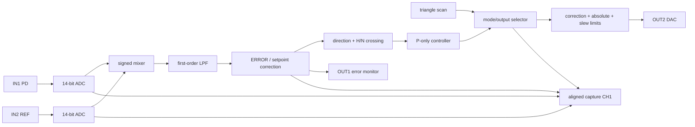

# FPGA-MTS v0.94 FIRST_LOCK RTL 审查

状态：`[CODE INSPECTED]`、Daisy 隔离为 `[IMPLEMENTED]`；修改后的 RTL 尚未 compile/simulate/synthesize/implement。
Gate：`LOCK-MVP-L1`。本文只审查单板 PZT P-only 路径，不批准 bitstream 或真实硬件 Gate。

## 1. 当前实时数据与控制链

`IN1`、`IN2`、mixer、LPF、crossing、capture 和 P controller 均在 `adc_clk` 域。四路 debug capture 共用写地址和 decimation tick。OUT2 最后在 `dac_clk_1x` 注册并完成 Red Pitaya signed-to-DAC-code 转换。

## 2. 定点、延迟与饱和

| 项目 | 当前实现 | FIRST_LOCK 判断 |
|---|---|---|
| ADC 语义 | Red Pitaya 官方 signed 14-bit 变换，模拟输入到内部 count 为负斜率 | GUI/示波器比较必须包含该符号约定 |
| Mixer | signed 14x14，算术右移 13 bit，饱和到 signed14 | 量程闭合；输入削顶仍会破坏 error |
| LPF | `y += (x-y)/4096` | 125 MHz 下约 32.8 us 时间常数、约 4.9 kHz 截止；会产生真实动态滞后 |
| Error | `error-setpoint` 后饱和到 -8192..8191 | crossing 使用的就是 servo error |
| P term | `signed_error * Kp >>> 8`，再做 correction limit | `Kp=4` 只是很小的首次非零步进，不保证足够环路增益 |
| Bias | crossing 拍捕获实际 `selected_out2` | 比从旧 GUI frame 直接写静态 bias 更接近 bumpless transfer |
| Absolute limit | 输出 target 最终限制在用户 safe min/max | 正确；safe range 必须来自 loaded PZT 节点实测 |
| Slew limit | 对递归 control output 做单步限制 | 限制切换瞬态，但也限制慢环可实现带宽 |
| P pipeline | 当前 8 个 `adc_clk` 周期，约 64 ns | 相对 PZT 慢执行器可忽略；须由修改后 timing 重新证明 |
| CH4 capture | `selected_out2`，DAC 前数字 command | 不是 OUT2 引脚电压、PZT 位移或激光频率 |

## 3. SAFE / SCAN / HOLD / P_LOCK 审查

- `SAFE`：输出回到安全值，且 host 只有在 `MODE=SAFE`、`ENABLE=0`、acquisition state 为 SAFE 的 readback 一致时才报告 confirmed。
- `SCAN`：triangle 输出受 scan min/max 和最终 absolute limit 约束。ramp 的 candidate/commit 需要额外时钟，因此实际 scan frequency 会与 host 理想公式有小偏差。
- `HOLD`：可用于工程诊断，不应作为首次锁定主路径中的手动找 bias 手段。
- `P_LOCK`：有效关系为 `OUT2 = captured_bias + clamp((polarity ? -error : error) * Kp / 256)`，之后再经过 absolute/slew limit。
- acquisition：只接受指定扫描方向、guard 内的 H/N 合格 crossing；VALIDATE 只记录事件，ACTIVE 才捕获 bias 并进入 Kp soft-start。
- supervisor：异常、失败、fault 必须回 SAFE；当前 Gate 不允许自动重锁、自动 polarity 或自动提高 Kp。

对局部斜率 `dERROR/dOUT2`，负反馈的初始极性应满足：斜率为正时使用 invert，斜率为负时使用 normal。这个结论必须在同一扫描方向、同一 frame 和安全小幅扫描下确认，不能只凭 MTS 波形外观猜测。

## 4. Clock / CDC / timing

9 月 2 日 routed build 的 setup/hold 数值为正，但其 `red_pitaya_daisy` 存在大量 `pll_adc_clk <-> par_clk` critical CDC，因此不是可接受的 Timing Gate PASS。

本轮唯一 RTL 修改是在 `red_pitaya_top` 增加默认 `ENABLE_DAISY=0`：

- 默认 build 不再 elaboration legacy recovered-clock Daisy 实例；
- SATA 差分输出固定到静态互补值；
- `adc_clk_daisy` 回到本地 `adc_clk`；
- legacy bus slot 返回确定的空响应；
- 未添加 false path，未删除 legacy module，也未改 CSR、`MAGIC`、`VERSION`、L1 capability、锁定状态机或 XDC。

这应消除 Daisy 造成的 no-clock/unconstrained/CDC 对象，但这是源代码推断，不是 timing 证据。DNA 逻辑及 ADC/DAC/扩展接口的 `check_timing` 项仍需逐项分类；active rule 要求的 unconstrained path 不能用“与 L1 无关”直接视为通过。

## 5. 与 Linien 的关键差异

| 维度 | Linien 2.1.0 | FPGA-MTS v0.94 | FIRST_LOCK 结论 |
|---|---|---|---|
| 实时控制 | FPGA fast PID，可选 slow integrator | FPGA P-only 慢 PZT；D2-125 保留电流快环 | 当前分工更适合本实验，不扩展 PI |
| Error 前端 | IQ demod、级联 IIR、双通道组合 | IN1*IN2 + 单一 LPF | 足够做首次候选，但必须实测 SNR/相位 |
| Lock trigger | sweep position 或 FPGA feature detector | FPGA direction + realtime zero crossing | 保留当前确定性 crossing |
| Transfer | hold sweep 后 PID 接管 | crossing 拍捕获实际 bias，再 soft-start | 当前方式有利于减少跳变 |
| Capture | triggered scope，板端服务管理新帧 | 同拍四通道 BRAM，SSH helper 读取 | 帧内对齐正确；frame age 仍需明确 |
| 多板 | 主 gateware 未使用多板同步 | legacy Daisy 原本总是实例化 | FIRST_LOCK 默认静态隔离 |
| 失锁 | 代码含检查/重锁框架，2.1.0 部分功能禁用 | 有限 supervisor，异常 SAFE | 不引入自动重锁 |

## 6. 当前锁不上原因排序

以下是待实验验证的因果假设，不是已确认故障：

1. **尚无 timing-clean 的修改后 candidate**：在新报告通过前不能排除实现风险，也不能进入硬件。
2. **比较了不同物理量**：CH4 是 DAC 前 command，scope 是 DAC/负载/PZT 节点；旧软件电压标定不能代替 loaded-node 测量。
3. **扫描方向、PZT 迟滞与 plant 动态**：同一个 command 在 rising/falling 方向可能对应不同激光频率；LPF 也加入相位滞后。
4. **反馈极性或有效环路增益不合适**：错误极性会发散；`Kp=4`、correction limit、slew limit 和 PZT 响应共同决定是否有可见校正。
5. **ERROR 质量不足**：ADC 削顶、REF 相位/幅度、mixer 缩放、LPF 带宽或 MTS 信噪比可能让 crossing 可见但不适合闭环。
6. **外部接口/接地/负载问题**：D2-125 AUX 若未物理断开会形成输出并联；scope termination、PZT 输入阻抗、共地和电压范围均可能改变实际输出。
7. **旧 frame 或边缘选点**：SSH/GUI 造成整帧陈旧，当前约一周期窗口不利于重复性比较。
8. **纯网络延迟参与 servo**：可能性低；网络只负责配置和 frame 读取，不在每个 FPGA servo sample 回路内。

## 7. 审查结论

当前 FPGA 的单板实时 P-only 架构方向正确，没有发现必须为 FIRST_LOCK 重写 mixer、LPF、crossing 或 controller 的证据。最小必要 RTL 变更是已完成的 Daisy 编译期隔离。修改后 RTL 的 compile、simulation、synthesis、implementation、CDC、DRC、methodology 和完整 timing 均为 `[NOT VERIFIED]`。
