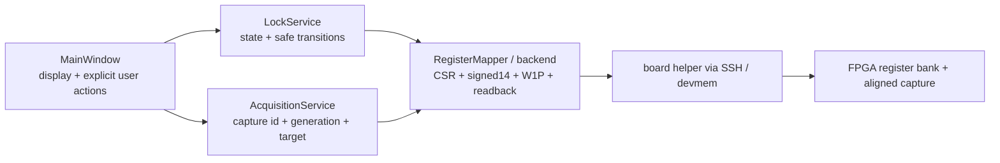

# FPGA-MTS v0.94 FIRST_LOCK Host / GUI 审查

状态：`[CODE INSPECTED]`。本轮未修改 Host/GUI 产品代码。

## 1. Host 职责链

边界总体符合 active spec：GUI 不执行逐采样 servo；LockService 拥有 host lock state 和失败 SAFE；register/backend 拥有 CSR 与数值转换；capture 服务管理 frame 和 generation。Windows/SSH 的延迟不会进入 FPGA 的 P-only 实时反馈。

## 2. Capture 与显示真实性

`custom_fpga_scan_control.py` 启动一次 FPGA capture，等待 done，再按相同 index 读取 CH1..CH4。RTL 四通道也在同一 `adc_clk`、同一 decimation tick 写入，因此当前证据支持“frame 内数字通道对齐”。

但显示必须区分：

| 数据 | 正确命名 | 证据边界 |
|---|---|---|
| CH1 | `IN1 PD ADC counts` | ADC 数字样本，不是独立校准的光功率 |
| CH3 | `FPGA ERROR counts` | servo 使用的 mixer+LPF 数值，不等于 OUT1 模拟实测 |
| CH4 | `FPGA OUT2 command counts (DAC-pre)` | 不是 OUT2/PZT 节点电压 |
| 软件换算 | `estimated voltage (calibration ..., not measured)` | 只在原 gain/offset、load 条件仍成立时有参考意义 |
| 示波器 | `measured PZT-node voltage` | 必须同时记录 probe、coupling、termination、load 和接地点 |

`out2_calibration.py` 的 1.13 center gain、0.009 V offset、1.18 amplitude gain 是软件历史校准模型，不能证明当前 PZT 接入后的绝对电压。因此 GUI cursor 与 scope cursor 的首要问题是量义不同，而不是 sample 数组被网络拆散。

## 3. Refresh、latency 与横轴

- Live Capture 使用 one-shot timer，不会并发堆叠 capture；500/1000/2000 ms 只是再次请求间隔。
- SSH 往返、capture wait 和绘图会让整帧变旧；GUI 应显示 capture 完成时间和 frame age。
- `map_display_time_to_capture_sample` 按 capture 的时间轴找最近 raw sample，未见明显 off-by-one 证据。
- host 按理想 ramp 公式计算 scan period；RTL ramp update 有额外 candidate/commit 周期，实际频率可能略偏。
- 当前 Lock View 约采一周期。应在后续最小 GUI patch 中改为两周期，方便验证同方向复现、比较 rising/falling 和避免选点落在 frame edge。
- 选点时应冻结当前 frame，并把 `capture_id`、`scan_generation`、direction 和 frame age 与 pending/confirmed target 一起显示。

## 4. Lock Point 流程

当前 `SCAN -> capture -> PICK -> CONFIRM -> ARM VALIDATE -> ARM ACTIVE` 适合首次真实实验，应保留人工分段确认。

优点：

- 点击只是在 ±64 sample 邻域寻找满足 SNR、slope、direction、guard、limit 的 ERROR crossing；
- target 与 capture/config generation 绑定，避免无意使用旧配置目标；
- ARM VALIDATE 不改变为 P_LOCK，只确认未来 crossing 事件；
- ACTIVE 后 FPGA 在未来同方向 crossing 拍捕获真实 scan command 作为 bias；
- ARM worker 与 Live Capture 串行化，降低 register/capture transport 竞争。

风险：

- Basic 区仍存在容易被理解成“一键锁定”的操作入口；首次上板必须显式暴露 SCAN、VALIDATE、ACTIVE 三步。
- Engineer 页面仍有 legacy HOLD、manual bias、较大 Kp、raw CSR 等控制；它们不应出现在 FIRST_LOCK 主路径。
- 手动 bias trim 不能解决迟滞或 frame 陈旧，反而可能移动 guard center。

## 5. 最小 Host/GUI 修改建议

本轮不修改 Host/GUI，因为这些问题不阻塞先完成 Daisy 后的 Timing Gate。Timing Gate 通过后，只做以下小改：

1. CH4 主标签改为 `FPGA OUT2 command (counts; DAC-pre)`；estimated voltage 单列并注明 `not measured`。
2. Lock View 从约 1.0 周期改为 2.0 周期，不改 capture 架构。
3. frame header 显示 age、capture id、scan generation、direction 和 command count。
4. 选点时冻结 frame；若 frame age 或 generation 不匹配则禁止 CONFIRM/ARM。
5. 第一次硬件视图显式显示 `SAFE -> SCAN -> VALIDATE -> ACTIVE Kp=0 -> Kp=4`，并把大 Kp、Ki、bias trim、raw CSR 留在 Engineer Details。
6. 增加纯人工接线确认显示：D2-125 Main Servo 保持电流快环；D2-125 AUX 已与 PZT 物理断开。

这些是命名、显示和安全门控优化，不需要 GUI 重构，也不改变 FPGA/Host 职责边界。

## 6. Host 结论

没有证据表明 SSH 或 GUI refresh 导致同一 capture 中 CH3/CH4 sample index 错位。Host 的关键改进应是让“数字 command、软件 estimate、物理 measured”不可混淆，并显示 frame 新鲜度。真正的 lock transfer 已在 FPGA crossing 时基内完成，不应迁回 Windows。
