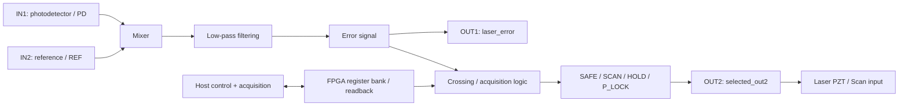

# FPGA-MTS

**FPGA-MTS** is a research-stage FPGA/host control stack for modulation-transfer-spectroscopy (MTS) laser-frequency stabilization on the **Red Pitaya STEMlab 125-14**.

The project separates deterministic real-time signal processing and lock control in the FPGA from configuration, acquisition, operator decisions, and experiment logging on the host. Its current engineering target is a simple, reproducible **PZT P-only lock** with explicit safety gates and traceable verification evidence.

> **Project status:** active research prototype. The current milestone is `LOCK-MVP-L1`. A routed candidate build and software/RTL verification evidence exist, but the current candidate has **not** yet closed the full real-hardware sustained-lock gate. This repository should not be treated as a production-ready laser controller.

## Why this project exists

Laser-frequency stabilization is a common requirement in atomic, molecular, and optical (AMO) experiments, but practical laboratory systems are often tightly coupled to specific hardware, difficult to reproduce, or difficult to audit across FPGA, host software, bitstream, and experiment state.

FPGA-MTS is intended to explore a more transparent path:

- low-cost Red Pitaya hardware as the digital control platform;
- explicit FPGA/host responsibility boundaries;
- simulation, timing, build, and hardware evidence kept separate;
- safety-sensitive output transitions gated by readback and human approval;
- reproducible build/release records rather than an untracked “working bitstream.”

The project is deliberately conservative about claims: code presence, RTL simulation, timing closure, GUI behavior, and physical laser locking are recorded as different kinds of evidence.

## Intended ecosystem value

FPGA-MTS sits at the intersection of open FPGA instrumentation, AMO laboratory control, and reproducible experimental software. The repository is intended to become useful to researchers who want to inspect and adapt a Red Pitaya-based laser-locking stack instead of treating the FPGA image, host controls, and physical experiment as an opaque appliance.

The project does **not** currently claim broad adoption or production maturity. Its near-term open-source value is the maintained engineering record: explicit signal semantics, Host/FPGA contracts, safety boundaries, simulation and timing evidence, candidate-bit provenance, and a public path toward a hardware-validated release. Outside reuse should become easier as the licensing and clean-clone reproducibility work is completed.

## System overview



During the current hardware gate, the external D2-125 main servo remains responsible for the fast current-feedback path while FPGA `OUT2` is used only for the dedicated PZT/Scan path. Active outputs must never be paralleled.

## Current scope

The current gate focuses on the minimum deterministic loop:

```text
SAFE
  -> SCAN
  -> aligned capture / valid ERROR crossing
  -> operator selects a target
  -> HOLD with Kp = 0
  -> operator-approved small P gain
  -> sustained P-only lock
  -> anomaly => SAFE
```

Current scope **does not** claim a validated PI/Ki loop, automatic relock, automatic phase optimization, dual-actuator control, or deployed AI/deep-learning optimization. Those are later research directions and must not be inferred from experimental or reference material in the repository.

For the authoritative, evidence-backed state of the project, see [`docs/CURRENT_STATUS.md`](docs/CURRENT_STATUS.md).

## Hardware and toolchain

- **Board:** Red Pitaya STEMlab 125-14
- **FPGA device:** Xilinx Zynq-7010 (`xc7z010clg400-1`)
- **FPGA toolchain:** Vivado 2020.1
- **Primary top:** `red_pitaya_top`
- **Host environment:** currently developed and tested primarily on Windows

The active Vivado project is under `v0.94/project/`. Build and release claims are governed by the repository's documented verification process rather than by file timestamps or generated-run folders.

## Repository map

| Path | Purpose |
| --- | --- |
| `v0.94/rtl/` | FPGA RTL and Red Pitaya integration sources |
| `v0.94/sim/`, `v0.94/tbn/` | RTL simulation/testbench assets |
| `v0.94/project/` | Active Vivado project |
| `software/redpitaya_lock_host/` | Host-side control, acquisition, readback, and GUI/backend code |
| `docs/` | Current project context, status, FPGA/Host interface, development and release rules |
| `scripts/` | Project maintenance/build-support scripts |
| `reference/` | Upstream/reference material and engineering comparisons; not the authority for the current build |

Recommended reading order for new contributors:

1. [`docs/PROJECT_CONTEXT.md`](docs/PROJECT_CONTEXT.md) — project intent and architecture context
2. [`docs/CURRENT_STATUS.md`](docs/CURRENT_STATUS.md) — current gate, verified facts, blockers, and next action
3. [`ROADMAP.md`](ROADMAP.md) — public maintainer priorities
4. [`docs/HOST_FPGA_INTERFACE.md`](docs/HOST_FPGA_INTERFACE.md) — host/FPGA contract
5. [`docs/FPGA_DEVELOPMENT_RULES.md`](docs/FPGA_DEVELOPMENT_RULES.md) — FPGA verification requirements
6. [`docs/RELEASE_PROCESS.md`](docs/RELEASE_PROCESS.md) — bitstream provenance and release rules

## Maintenance and project health

FPGA-MTS is currently maintained by **[@666vitas](https://github.com/666vitas)** as the primary maintainer and repository owner. Maintainer responsibilities and the decision model are documented in [`MAINTAINERS.md`](MAINTAINERS.md), with code ownership recorded in `.github/CODEOWNERS`.

Current public maintenance priorities are intentionally concrete:

- [#4 — complete license/provenance audit and select the top-level OSS license](https://github.com/666vitas/FPGA-MTS/issues/4)
- [#5 — document a clean clone-to-test workflow without laser hardware](https://github.com/666vitas/FPGA-MTS/issues/5)
- [#6 — close the real-hardware `LOCK-MVP-L1` sustained P-only lock gate](https://github.com/666vitas/FPGA-MTS/issues/6)
- [#7 — publish the first hardware-validated, traceable release](https://github.com/666vitas/FPGA-MTS/issues/7)

Obsolete draft pull requests are closed with a supersession reason instead of being left as competing implementation baselines. New bug, enhancement, and hardware-validation reports use structured issue forms so the evidence level and hardware state are explicit.

## Verification philosophy

A central project rule is that different evidence levels are not interchangeable.

Examples:

- source inspection does not prove simulation passed;
- simulation does not prove routed timing passed;
- a generated bitstream does not prove it was loaded on hardware;
- GUI state does not prove the physical laser is locked;
- a short closed-loop observation does not prove long-term frequency stability.

The exact latest simulation, host-test, timing, DRC/CDC, candidate-bit, and hardware status is maintained in [`docs/CURRENT_STATUS.md`](docs/CURRENT_STATUS.md). Historical evidence is retained for traceability but must not be used to silently upgrade the current status.

## Hardware safety

This repository controls real laboratory hardware. Before connecting or loading a candidate build, read the current gate and hardware constraints.

At minimum:

- `OUT2` is restricted to the dedicated laser PZT/Scan input authorized by the current gate and to measurement equipment;
- do **not** connect `OUT2` to laser current modulation, a D2-125 output, or another active output;
- do not parallel the FPGA output with the D2-125 AUX output;
- input/output ranges, scope loading/coupling, readback, saturation, and polarity must be checked before non-zero feedback gain is applied;
- any identity/readback/range/saturation anomaly returns the experiment to `SAFE`.

See [`SECURITY.md`](SECURITY.md) for security and hardware-safety reporting.

## Getting started

This is currently a laboratory research repository rather than a one-command end-user package. A safe first interaction is therefore to inspect and reproduce the documented software/RTL evidence **without connecting a laser**.

```bash
git clone https://github.com/666vitas/FPGA-MTS.git
cd FPGA-MTS
```

Then read the current status and the relevant development rules before running Vivado, changing RTL, or interacting with a Red Pitaya. Do not treat old `exp/` runs or historical bitstreams as current releases.

The clean-clone reproducibility task is tracked in [issue #5](https://github.com/666vitas/FPGA-MTS/issues/5). Until that closes, maintainer-local commands or paths in older documentation should not be presented as a verified portable workflow.

## Contributing and support

Contributions that improve reproducibility, verification, documentation, host/FPGA interface clarity, simulation coverage, and safe laboratory operation are welcome.

Please read [`CONTRIBUTING.md`](CONTRIBUTING.md) before opening a pull request. Hardware-affecting changes require explicit safety impact and verification notes; generated artifacts and unsupported performance claims should not be added as evidence.

For questions, reproducibility reports, and hardware-reporting expectations, see [`SUPPORT.md`](SUPPORT.md).

## Third-party material and licensing status

This repository contains upstream/reference snapshots under `reference/` as well as Red Pitaya-derived integration material. Those components retain their original copyright and license terms; known notices are summarized in [`THIRD_PARTY_NOTICES.md`](THIRD_PARTY_NOTICES.md).

**A repository-wide top-level license has not yet been finalized.** The provenance audit and license decision are tracked publicly in [issue #4](https://github.com/666vitas/FPGA-MTS/issues/4). Until that work is complete and a root license is added, do not assume that every file in this repository is granted under a single license.

## 中文说明

FPGA-MTS 是一个基于 Red Pitaya STEMlab 125-14 的 MTS 激光稳频研究项目。当前重点不是扩展更多功能，而是先完成可追溯、可重复的真实 PZT P-only 基础锁定，并严格区分代码、仿真、时序、GUI 与真实硬件证据。当前状态与实验边界以 [`docs/CURRENT_STATUS.md`](docs/CURRENT_STATUS.md) 为准；公开维护计划见 [`ROADMAP.md`](ROADMAP.md)。