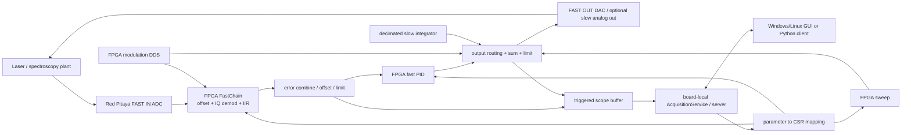

# Linien 2.1.0 架构分析（面向 FPGA-MTS FIRST_LOCK）

状态：`[CODE INSPECTED]`
范围：本地 `open source/linien/linien-master`、`linien-2.1.0.exe` 版本标识和 `linien实验.docx`。未发现用户提到的 `linien.pptx`；未对安装器二进制做逆向分析。本文只学习架构思想，不复制 Linien 代码。

## 1. 系统整体架构

Linien 的关键不是某个 PID 算法，而是把非实时管理与实时控制分开：GUI 是远程客户端；Red Pitaya 上的 server 拥有参数、采集和锁定任务；FPGA 完成每个采样点的调制、解调、滤波、扫频、PID、限幅和锁定触发。



数据流可分为五层：

1. `PitayaAnalog` 接入两路 14-bit ADC，并驱动两路高速 DAC。
2. `FastChain` 对每路 ADC 做 offset、正交解调、IIR 和限幅，得到 I/Q。
3. `LinienLogic` 组合单/双通道 error，选择 PID 输入、扫频输出和控制输出。
4. `ScopeGen` 在扫频触发或锁定状态下采集 FPGA 内部 signal tap。
5. 板端 server 把 capture、参数和状态发布给 GUI；GUI 不参与每个 servo sample。

这与 FPGA-MTS 应保留的边界一致：Windows 负责显示和命令，FPGA 负责实时 `mixer/LPF -> crossing -> P-only -> OUT2`。

## 2. FPGA 架构分析

### 2.1 ADC 输入与数字前端

Linien 用两个 `FastChain` 分别接 ADC A/B。每条链包含：

- 14-bit signed ADC 输入；
- 可配置 offset / invert；
- 基于同一个调制相位的 I/Q demodulation；
- I、Q 各自的限幅和级联 IIR；
- 可选择滤波前或不同滤波级作为输出 tap。

这样设计的原因是把“模拟接线差异”“解调相位”“滤波带宽”和“servo 输入”拆成可配置但仍实时的 FPGA 数据通路。FPGA-MTS 第一次锁定不需要照搬 I/Q、自动相位和双通道组合；现有 `IN1 * IN2 -> first-order LPF` 已足够形成 MTS error 候选，前提是实际信号幅度、相位和噪声已由示波器验证。

### 2.2 Demodulation、error signal 与滤波

Linien 的调制、demodulation 和滤波都在 FPGA 中，组合 error 前先对每路信号限幅。单通道时主要使用 channel A 的 I 分量；双通道时才按 factor 组合 A/B。

这种安排的价值：

- ADC 到 error 的延迟确定，不受网络影响；
- GUI 看到的 spectroscopy/error 可以从与 PID 相同的内部节点采集；
- 滤波和限幅在进入 PID 前完成，避免软件刷新参与反馈；
- I/Q 同时保留，便于后续相位诊断，但不是 FIRST_LOCK 必需项。

FPGA-MTS 当前 `mixer_core` 使用 14x14 signed 乘法、`>>>13` 缩放并饱和；`lpf_core` 实现 `y += (x-y)/4096`。在 125 MHz 下，其一阶时间常数约 32.8 us、近似截止频率约 4.9 kHz。它会造成真实 error 相对于瞬时 PD/PZT 的动态相位/位置偏移，但不会由 GUI 网络刷新造成帧内 CH3/CH4 错位。

### 2.3 PID 与 actuator output

Linien fast PID 使用 error-setpoint、signed P/I/D、积分饱和和最终输出饱和。`lock_running` 为真后 PID 才接收非零 error；扫频同时 hold。输出端不是“PID 直接覆盖 DAC”，而是按通道选择把 PID、modulation、sweep、offset、slow control 相加，再统一限幅后进 DAC。

这样设计可保证：

- 锁定切换发生在 FPGA 内部，而不是网络命令到达的随机时刻；
- sweep 与 PID 的输出语义明确；
- actuator limit 在最后一级实施；
- 快 PID 与可选慢积分器分开。

FPGA-MTS FIRST_LOCK 只需要其中的最小子集：`selected_out2 = bias + signed(Kp * (error-setpoint) >>> 8)`，再经过 correction limit、absolute limit、servo divider 和 slew limit。D2-125 Main Servo 继续负责电流快环；FPGA OUT2 只负责 PZT 慢环，因此不需要复制 Linien 的 fast PID、second integrator 或输出混合矩阵。

## 3. Lock 流程

Linien 的简单流程是：

```text
SWEEP
-> 用户手动居中/选 slope，或框选目标线
-> server 计算目标、写入参数
-> FPGA 在指定 sweep position/peak pattern 上触发
-> sweep hold
-> lock_running=1
-> PID 接管 DAC
-> server/GUI 观察 error 与 control
```

`SimpleAutolock` 在上升扫描到达 target position 附近时发出 `turn_on_lock`。`RobustAutolock` 则在 FPGA 中按峰值符号、阈值和等待距离识别一组特征，再开启 lock。README 明确说明 robust 模式将 jitter-sensitive detection 放在 FPGA 内，以避免 CPU/FPGA 通信延迟。

Linien 2.1.0 的 README 同时说明 lock detection / automatic relocking 暂时禁用，因此不能把“代码里有 autolock”解释为 2.1.0 会可靠自动失锁重锁。

与 FPGA-MTS 当前 L1 的比较：

| Linien | FPGA-MTS L1 | FIRST_LOCK 判断 |
|---|---|---|
| Sweep | `MODE=SCAN` triangle | 等价的扫描准备态 |
| simple target position / robust feature detector | H/N realtime ERROR crossing + scan direction + OUT2 guard | FPGA-MTS 更适合当前“指定 error 零交叉”目标 |
| `lock_running` 同时 hold sweep、enable PID | crossing 拍捕获实际 `selected_out2`，进入 `ACQUIRING`，Kp soft-start | 原子 bias capture 可减少 scan-to-lock 跳变 |
| PID active | `P_LOCK`, Ki=0 | FIRST_LOCK 只保留 P-only |
| lock check/watch（2.1.0 部分禁用） | L1 supervisor: `P_LOCKED/FAILED/FAULT -> SAFE` | 只保留有限、可解释的安全判断，不做自动重锁 |

推荐保留 FPGA-MTS 的 `SAFE -> SCAN -> ARM_VALIDATE -> ARM_ACTIVE -> ACQUIRING -> P_LOCKED/SAFE`，不改成 Linien 的完整 autolock。

## 4. Daisy / 多板同步

在本地 Linien 2.1.0 主 gateware 中没有发现被实例化的 Red Pitaya daisy/multi-board 数据通路。平台文件声明 SATA 引脚和一个 period constraint，但 `LinienModule` 不请求 SATA 资源，也没有把多板同步放入锁定链。

因此以下 Linien 功能都不等于多板同步：

- 多个 GUI/Python client 连接同一个板端 server；
- dual-channel spectroscopy（同一块板的两路 ADC）；
- fast PID + slow analog output（同一块板的两种 actuator 时间尺度）；
- scope trigger 与 sweep 同步（同一 FPGA 内部）。

FPGA-MTS 当前只使用一块 Red Pitaya，legacy `red_pitaya_daisy` 对 FIRST_LOCK 没有功能价值，却引入 `pll_adc_clk <-> par_clk` CDC、no-clock 和 unconstrained endpoints。正确处理是编译期静态隔离，不是添加 blanket false path，也不是修建多板功能。

## 5. 对 FIRST_LOCK 可借鉴与明确不借鉴

可借鉴：

- GUI/板端服务/FPGA 实时链分层；
- capture 与 sweep trigger/状态绑定；
- 锁定触发在 FPGA 内发生；
- error 与 control 使用同一 capture 时基；
- 输出限幅、readback 和失败原因显式化。

当前不借鉴：

- robust autolock、自动识峰、自动重锁；
- IQ 自动相位优化；
- 双通道 FMS+MTS；
- second integrator / PI/Ki；
- 多板同步；
- ML、PSD 和大规模 GUI 重构。

## 6. 主要本地证据

- `open source/linien/linien-master/gateware/linien_module.py`
- `open source/linien/linien-master/gateware/logic/chains.py`
- `open source/linien/linien-master/gateware/logic/pid.py`
- `open source/linien/linien-master/gateware/logic/sweep.py`
- `open source/linien/linien-master/gateware/logic/autolock.py`
- `open source/linien/linien-master/linien-server/linien_server/acquisition.py`
- `open source/linien/linien-master/linien-server/linien_server/registers.py`
- `open source/linien/linien-master/README.md`
- `open source/linien/linien实验.docx`（只读文本提取；未完成页面渲染）
